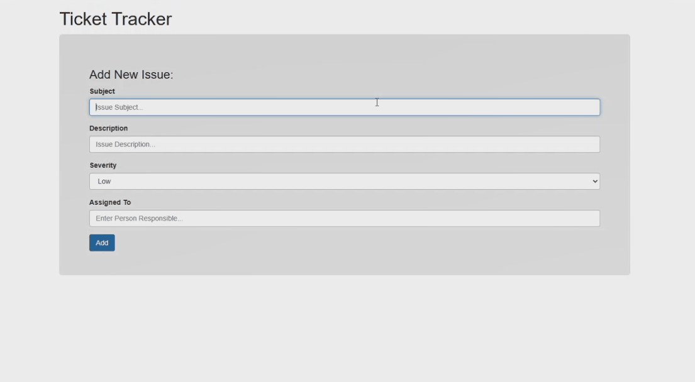

# Ticket Tracker
Need a ticket tracker? Use this app to keep up with customer needs and sort out their issues.

**Link to live project:** https://ticket-txk1.onrender.com/

**Link to repository:** https://github.com/DominikJ22/ticket-tracker

 

## How It's Made:

**Tech used:** HTML, CSS, JavaScript, Bootstrap, and EJS

I used an MVC structure to organize my application. 

## Optimizations
*(optional)*

## Lessons Learned:

In building this app I learned how to use EJS and create an application

## Examples:
Take a look at these couple examples that I have in my own portfolio:

**other:** 
